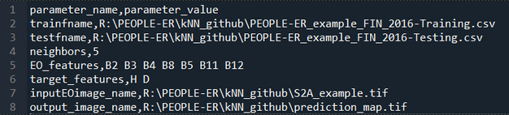

# Getting Started with PEOPLE-ER k-NN

This document will serve as a guide on how to start using the PEOPLE-ER k-NN python tool. It will go over the installation and required inputs of the tool.

## 1. Installation

The k-NN tool is provided as a Python script that can be edited as necessary or run with text example settings. The script is provided with several auxiliary files, as a downloadable zip-file named *'PEOPLE-ER_kNN_tool.zip'*. The downloadable zip-file can be found in the tool's [GitHub repository](https://github.com/PEOPLE-ER) under the data folder.

After unpacking the zip-file to a suitable local directory, the script can be run using python after installing the required packages in the processing environment. An environment file, listing necessary Python packages is provided in the zip file.

The contents of the tool is thus represented by the following files:

1. **peopleER_kNN.py** – main python file with kNNRegression class, training and prediction script. 

2. **knnsettings.csv** – parameters file, prefilled for demo-example; this is the place where parameters can be stored to avoid keyboard input. 

3. **knnenv.yml** – environment file listing necessary python packages. This file is to be used when e.g., creating a virtual environment in conda.  

4. **S2A_example.tif** – a sample file containing several Sentinel-2 image bands over sample area of interest in Finland. 

5. **PEOPLE-ER_example_FIN_2016-Training.csv** – a sample EO feature bank that can be used for training/defining kNN model, contains values of forest plots measurements and values of various EO image features calculated for these plots.  

6. **PEOPLE-ER_example_FIN_2016-Testing.csv** - a sample EO feature bank that can be used for accuracy assessment (testing) of kNN model.

## 2. Input Parameters

To begin using the tool, you need to set up a python environment using information form knnenv.yml file using for example the ```conda env create -f knnenv.yml``` command.

Further, an input EO image stack at the extent of your area of interest (AOI) for which the forest mapping will be done, and the corresponding feature bank(s), should be prepared before k-NN prediction of forest variables. Feature bank can contain excessive information if needed, for example EO features that are not present in the model or EO dataset. However, when running the tool, it’s important to make sure that the amount and order of input EO features listed in the parameters (manually input or read from knnsettings.csv) corresponds to that in input EO image.  

Please see the ”About the tool” page for information on how to prepare the feature banks.  

It is with the prepared input EO image dataset and feature bank(s) that the tool can be run.

The following briefly describes the input parameters required:

| Parameter | Description |
| --- | --- |
| trainfname | Name of EO feature bank used in model training/definition, contains data on both EO features and forest variable values for a sample of training forest plots measurements   |
| testfname | Name of EO feature bank used in model accuracy assessment (when absent, the accuracy can be calculated on the training dataset, even though this is generally discouraged practice) |
| neighbors | Number of neighbors in the kNN regression model |
| EO_features | List of EO features used in kNN modeling, represents a subset of features present in the EO bank |
| target_features | List of forest variables for which prediction is performed using the kNN model defined earlier, also represents a subset of features present in the EO bank |
| inputEOimage_name | Name of input EO image tiff-file, a stack of EO feature layers that corresponds to list of EO features defined above |
| output_image_name | Name of tiff-file where produced forest variable maps will be stored in the order specified in target features list|

Default *knnsettings.csv* file is prefilled with sample values, with the parameter name and parameter value separated by comma, each parameter starting from a new line:  



# 3. Running the Tool

To run the k-NN tool follow these steps:

1. Prepare or decide on processing parameters and save them in knnsettings.csv or be ready to type them in answering to queries.
2. Prepare feature banks for training and testing (accuracy assessment). If no testing data are available, training data filename can be used instead.
3. Prepare EO image stack and make sure EO image layers correspond to EO feature list stored in knnsettings.csv.
4. Run peopleER_kNN.py as needed.

The output tiff-file will contain the produced map for the chosen forest variables specified in the target_features parameter.