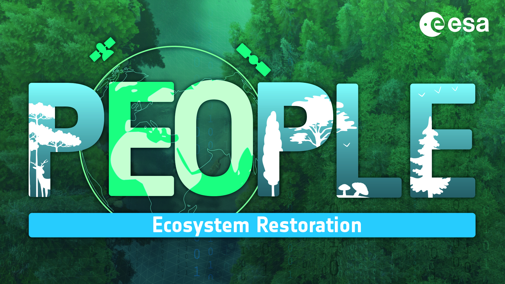

# Welcome to the PEOPLE-ER k-Nearest Neighbours (k-NN) tool!

{align=center}

## Problem Statement

The provision of a generic k-NN tool as part of the PEOPLE-ER toolbox allows users to derive additional information on the status of the ecosystem with a variety of datasets. The tool is not limited to any specific type of reference or remotely sensed data, but can be used with the datasets available for the area of interest. The PEOPLE-ER k-NN tool should be seen as a supporting tool for the main ecosystem recovery monitoring tools developed in the project. This tool can be used to provide further information within and around the restoration areas, benefiting from the field reference data the users have collected.

## k-NN Tool Objective

The objective of the PEOPLE-ER k-NN tool is to provide a generic tool to conduct k Nearest Neighbour (k-NN) prediction of continuous forest target variables of interest. In the context of Ecosystem Restoration (ER) monitoring, the tool allows wall-to-wall propagation of the variables of interest using field reference data and provided EO datasets. 

Together with the [PEOPLE-ER Spectral Recovery Tool](https://people-er.github.io/Spectral-Recovery/), it provides users with the possibility to approximate the ecosystems’ status (e.g., in the form of forest structural variable development) at any given time during the recovery process. It allows users to use any available combination of EO and auxiliary layers, together with their own or external field reference data. The field reference data can be in the form of field plot measurements or forest compartment (stand) level data.

## Table of Contents

This documentation contains:

- 1) About k-NN; a technical description of the k-NN tool.
- 2) Getting Started; a guide on how to get started using the k-NN tool using python.

## Workflow Diagram

## Demonstration Area

The area used for the demonstration of this tool is in Northern Finland. A subset of a Sentinel-2 scene is provided in order to test the tool (tile ID 35WMP).

## Acknowledgements

This tutorial was developed within the Pioneer Earth Observation apPlications for the Environment Ecosystem
Restoration (PEOPLE-ER) project financed by the European Space Agency (ESA). Members of the PEOPLE-ER consortium include:

{align=center}

{align=center}

{align=center}

{align=center}

{align=center}

## How to Cite

When using this tool in your work we ask that you please cite the Spectral_Recovery tool as follows:

"The k-NN Tool was developed by VTT as part of the PEOPLE-ER Project, managed by Hatfield Consultants, and financed by the European Space Agency."

## License

 [PEOPLE-ER k-NN Tool](httpps://www.people-er.github.io/k-NN) © 2023 by [PEOPLE-ER Project](people-er.info) is licensed under [Attribution-ShareAlike 4.0 International](http://creativecommons.org/licenses/by-sa/4.0/?ref=chooser-v1)
